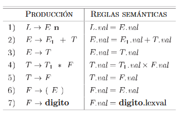
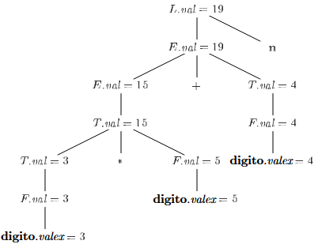

# Traducción dirigida por la sintaxis

La traducción dirigida por la sintaxis (SDT) es un método de implementación de compiladores en el que la traducción del código fuente está completamente guiada por la estructura sintáctica del programa. En lugar de separar el análisis sintáctico y la generación de código en fases independientes, se asocian reglas semánticas o fragmentos de programa (acciones) directamente a las producciones de la gramática.

El valor de los atributos se calcula mediante reglas semánticas que se asocian en cada producción.

Por ejemplo: un traductor de infijo a postfijo podría tener la siguiente producción con la siguiente regla:

```bnf
PRODUCCIÖN      REGLA SEMÁNTICA
E → E1 “+” T    E.codigo = E1.codigo || T.codigo || ′+'
```

La regla semántica especifica que la cadena
E.codigo debe formarse mediante la concatenación de E1.codigo, T.codigo y el carácter ′+′.

**Existen 2 notaciones**:

- Definiciones dirigidas por la sintaxis
- Esquemas de traducción

## Definiciones dirigidas por la sintaxis

Una definición dirigida por la sintaxis es una gramática libre de contexto, junto con atributos y reglas. Los atributos sintetizados se asocian con los símbolos gramaticales y las reglas se asocian con las producciones.

Tipos de atributos:

- Sintetizados
- Heredados

### Sintetizados

Se calcula utilizando únicamente los valores de los atributos de los hijos y del nodo mismo. Se utiliza principalmente en evaluaciones de abajo hacia arriba.

### Heredados

Se calcula utilizando los valores de los atributos del padre, los hermanos y el nodo mismo. Se utiliza en la evaluación de arriba hacia abajo.

## Esquemas de traducción

Es una notación para especificar una traducción, uniendo los fragmentos de un programa a las producciones en una gramática. Un esquema de traducción es como una definición orientada a la sintaxis, sólo que el orden de evaluación de las reglas semánticas se especifica en forma explícita.

Los fragmentos de un programa incrustados dentro de los cuerpos de las producciones se llaman `acciones semánticas`. La posición en la que debe ejecutarse una acción se muestra encerrada entre llaves y se escribe dentro del cuerpo de producción.

# DDS vs Esquemas de traducción

| DDS                                                                                             | Esquemas de traducción                                                                                            |
| ----------------------------------------------------------------------------------------------- | ----------------------------------------------------------------------------------------------------------------- |
| SDD : Especifica los valores de los atributos asociando reglas semánticas con las producciones. | SDT: Incorpora fragmentos de programa (también llamados acciones semánticas) dentro de los cuerpos de producción. |
| `E → E + T { E.val := E1.val + T.val }`                                                         | `E → E + T { imprimir('+'); }`                                                                                    |
| Siempre se escribe al final del cuerpo de la producción.                                        | La posición de la acción define el orden en que se ejecuta la acción (en medio de la producción o al final).      |
| Se utiliza para especificar los no terminales.                                                  | Se utiliza para implementar SDD con atribución S y SDD con atribución L.                                          |
| Especifica qué cálculo se debe realizar en cada producción.                                     | Especifica qué cálculo se debe realizar en cada producción y en qué momento se deben realizar.                    |
| Evaluación de izquierda a derecha.                                                              | Evaluación de izquierda a derecha.                                                                                |
| Se utiliza para conocer el valor de los no terminales.                                          | Se utiliza para generar código intermedio.                                                                        |

> **Nota:** S-Attributed: Solo atributos sintetizados (se calculan a partir de los hijos).
> L-Attributed: Permiten atributos heredados (de padres o símbolos a la izquierda) con restricciones que aseguran evaluación en tiempo de parseo.

Definición orientada por la sintaxis de una calculadora de escritorio simple



Árbol de análisis sintáctico anotado para 3 ∗ 5 + 4 n


