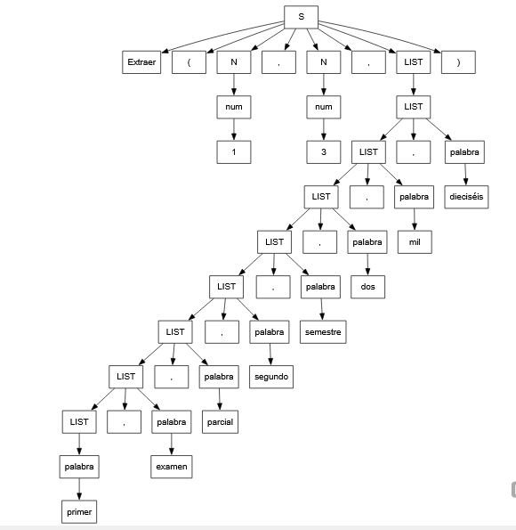
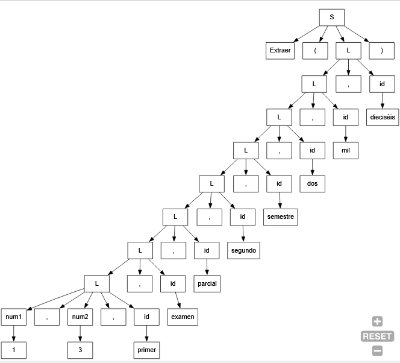
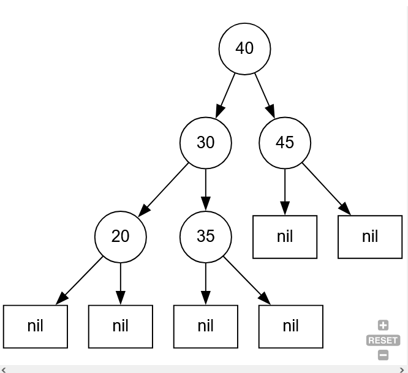
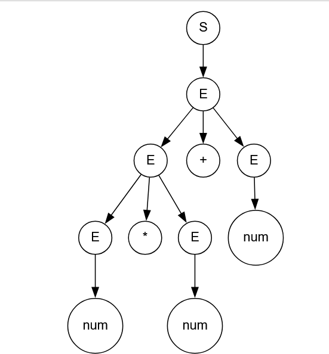

## Tema 1

### Gramática

```bash
S -> Extraer '(' N1 ',' N2 ',' LIST ')'
N -> num
LIST -> LIST ',' palabra
| palabra
```

### Esquema (atributos sintetizados)

```bash
S -> Extraer '(' N ',' N ',' LIST ')' {
if (N1.val < 1) then S.out = "ERROR, posicion de inicio incorrecta"
else if (N2.val < N1.val) then S.out = "ERROR, posicion de fin incorrecta"
else if (N1.val > LIST.len || N2.val > LIST.len) S.out = "ERROR, indice de lista fuera de rango"
else S.out = slice(LIST.join, N1, N2)
}
N -> num { N.val = num.lex }
LIST -> LIST ',' palabra { LIST.len = LIST.len + 1; LIST.join = concat(LIST.join, ",", palabra.lex) }
| palabra { LIST.len = 1; LIST.join = palabra.lex }
```

### Esquema (atributos heredados)

S -> Extraer '(' N1 ',' N2 ',' {LIST.her1 = N1.val; LIST.her2 = N2.val; } LIST ')'
N -> num { N.val = num.lex }
LIST -> { LIST1.her1 = LIST.her1; LIST1.her2 = LIST.her2 } LIST ',' palabra { LIST.len = LIST1.len + 1 }
| palabra { LIST.len = 1; L.error=""; }

### Arbol





## Tema 2

### Gramática

S -> T
T -> '(' NUM T T ')'
| 'nil'

### Esquema de traducción (analizador descendente)

S -> T { if T.ok then
imprimir("Está ordenado")
else:
imprimir("no lo está")
}
T -> '(' NUM { T1.menor = T.menor; T1.mayor = NUM.lex; T2.menor = NUM.lex; T2.mayor = T.mayor; } T T ')' { if NUM.lex >= T.menor and NUM.lex <= T.mayor then true else false }
| 'nil' { T.ok = true; }

arbol ordenado:



## Tema 3

### Gramática

S → E
E → E '+' T | T
T → T '\*' F | F
F → '(' E ')' | num

### Esquema

S -> E {S.tree = E.tree}
E -> E '+' T { E.tree = Nodo(E1.tree, leaf('+'), T.tree) }
| T { E.tree = T.tree }
T -> T '\*' F { T.tree = Nodo(T1.tree, leaf('\*'), F.tree) }
| F { T.tree = F.tree}
F -> '(' E ')' { F.tree = E.tree }
| num { F.tree = Nodo( leaf(val(num)) ) }


